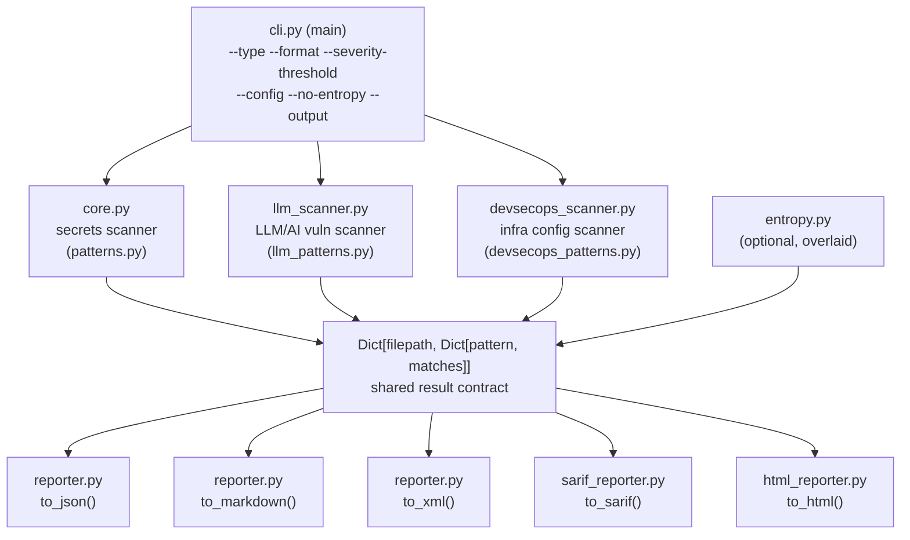

# Architecture

## Component overview

## Module map

| Module | Role | Key exports |
|--------|------|-------------|
| `cli.py` | Entry point, orchestration | `main()` |
| `core.py` | Secrets scanner + file filtering | `scan_file()`, `scan_directory()`, `should_skip_file()`, `should_skip_directory()` |
| `patterns.py` | 52+ secret regexes | `PATTERNS` |
| `llm_scanner.py` | LLM/AI vulnerability scanner | `scan_file_llm()`, `scan_directory_llm()` |
| `llm_patterns.py` | 18+ LLM/AI regexes | `LLM_PATTERNS`, `LLM_SEVERITY_MAP` |
| `devsecops_scanner.py` | Infra config scanner | `scan_file_devsecops()`, `scan_directory_devsecops()` |
| `devsecops_patterns.py` | 28+ infra regexes | `DEVSECOPS_PATTERNS`, `FILE_TYPE_FILTER` |
| `entropy.py` | Shannon entropy detection | `scan_file_entropy()`, `shannon_entropy()` |
| `ast_scanner.py` | Python AST structural analysis | `scan_file_ast()`, `scan_directory_ast()` |
| `validators.py` | Post-match false-positive reduction | `validate_match()`, `luhn_check()`, `is_valid_jwt()` |
| `owasp.py` | OWASP Top 10 / LLM Top 10 / CWE mapping | `get_owasp()` |
| `reporter.py` | JSON / Markdown / XML output | `to_json()`, `to_markdown()`, `to_xml()`, `get_severity()` |
| `sarif_reporter.py` | SARIF 2.1.0 output | `to_sarif()`, `generate_sarif_report()` |
| `html_reporter.py` | Self-contained HTML output | `to_html()`, `generate_html_report()` |
| `config.py` | `.secchecker.yml` loader | `load_config()`, `find_config_file()` |

## Design principles

- Zero runtime dependencies — stdlib only, no pip install chain to audit
- Python 3.8–3.14 compatible, tested in CI across all versions
- All scanners share a single file-filtering contract via `core.py` — no scanner walks files independently
- Config loading never raises — returns safe defaults on any parse error
- Reporters are pure functions: identical input always produces identical output
- Post-match validators (Luhn, JWT structure) reduce false positives before results are returned

## Using secchecker as a Python library

All scanners are available as functions that accept a file or directory path and return a consistent result structure. All reporters accept that structure and write to a file or return a string.

The shared result type is `Dict[filepath, Dict[pattern_name, List[matched_strings]]]`. Scanners can be run individually or composed — the CLI merges results from all active scanners before passing them to the selected reporter.

- **Scanner functions:** `scan_file`, `scan_directory` (secrets), `scan_file_llm`, `scan_directory_llm`, `scan_file_devsecops`, `scan_directory_devsecops`, `scan_file_ast`, `scan_directory_ast`, `scan_file_entropy`
- **Reporter functions:** `to_json`, `to_markdown`, `to_xml`, `to_sarif`, `to_html`
